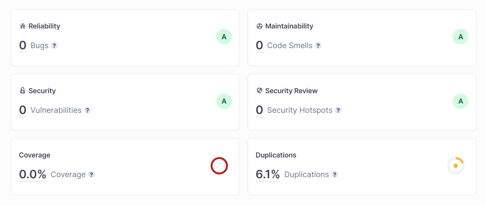

# LABs
1. **[lab 1 (structures)](https://github.com/gabrpavel/BSUIR#lab-1-structures)**
2. **[lab 2 (compressor/decompressor)](https://github.com/gabrpavel/term-2#lab-2-compressordecompressor)**
3. **[lab 3 (BMP-image editor)](https://github.com/gabrpavel/term-2#lab-3-bmp-image-editor)**
4. **[lab 4 (Akinator)](https://github.com/gabrpavel/term-2/blob/main/README.md#lab-4-akinator)**
5. **[lab 5 (hash table)](https://github.com/gabrpavel/term-2/blob/main/README.md#lab-5-hash-table)**

## lab 1 (structures)
### Task: write a program to work with an array of structures.
- Implement a function to create an array of structures.
- Implement a function for displaying an array of structures on the screen.
- Implement a function to initialize an instance of the structure.
- Implement array sorting functions for each field of the structure. (For example, you can sort students first by date of birth, then change your mind and sort by average score).
- Implement a menu to test the functionality.

**[CODE](term2/labs/lab1)**

## lab 2 (compressor/decompressor)
### Task: write a program that implements a simple text compression algorithm:
1.	Counting the frequency of occurrence of each word in the file.
2.	Finding the most popular among the longest words (A).
3.	Search for the most unpopular among short words (B).
4.	Replacing all words A and B with each other.
5.	Repeat items 2-4 as long as it makes sense.

**[CODE COMPRESSOR](https://github.com/gabrpavel/term-2/tree/main/labs/lab2/compressor)** 

**[CODE DECOMPRESSOR](https://github.com/gabrpavel/term-2/tree/main/labs/lab2/decompressor)**

## lab 3 (BMP-image editor)
### Task: write a program that implements a simple image processing.
* image conversion to NEGATIVE
* image conversion to BLACK AND WHITE
* Implement MEDIAN FILTERING
* Implement GAMMA CORRECTION

## Source image:

## Negative image:

## Black and white image:

## Median filtering (kernel = 3) image:

## Gamma correction (gamma = 1.5) image:

[CODE](labs/lab3/image_editor)

## lab 4 (Akinator)
### Task: write a program analogous to Akinator.
 The program must determine the object that the user has guessed. To do this, it must manage a binary tree in which information about the objects being hidden is stored. The work proceeds according to the following scenario.

1) The user makes a guess about the object.
2) The program asks questions to which the user answers yes/no.
3) Each answer leads to another question from the tree. So until the end (sheet) with the answer is reached.
4) If the answer is incorrect, the program should offer to enter data about the hidden object (a distinctive question) and remember the new object.
- Describe a separate API (library) to work with the binary tree.
- Implement the function of saving / loading the database of objects (saving the tree to a file). So as not to enter the database every time again.  

Additional task: add a reverse akinator to the functionality. The program guesses a random person from the list, and the user asks questions and guesses that person. 

[DATABASE](sources/database.txt)

[CODE](https://github.com/gabrpavel/term-2/tree/main/labs/lab4/akinator)

## lab 5 (hash table)
### Task: write a search program with a cache.
The program must search for an IP address by domain name in a file containing a DNS table. The search must be implemented through a cache with the LRU algorithm.
* Implement a hashing algorithm
* Implement a cache with the LRU algorithm
* Add the ability to add entries to the file (validations for IP entry and duplicate entries)
* Implement a search for all domain names for an IP address
  
[DNS](sources/DNS.txt)

[CODE](labs/lab5)
